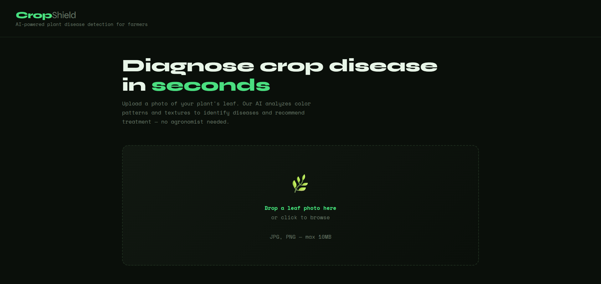
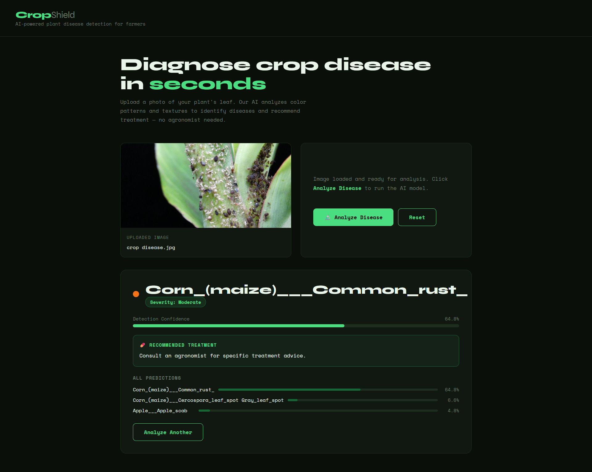

# crop-disease-detector

> Originally developed: September 2025 — open-sourced: June 2026

A computer vision tool that identifies plant diseases from leaf images. Upload a photo and get the top 3 most likely conditions, confidence scores, and treatment recommendations.

Built this because farmers in my area were applying the wrong treatments - fungicide for viral diseases, for example - simply because proper diagnosis was inaccessible and expensive. Wanted to see how far a lightweight pipeline could get without a GPU or cloud dependency.

## How it works

Each image goes through a 45-feature extraction pipeline - RGB channel statistics at multiple scales, green/brown/yellow ratios, texture variance, edge density, spot density, and 16-bin grayscale histogram. A Random Forest classifier (500 trees) trained on the PlantVillage dataset maps these to one of 38 disease classes across 14 crop types.

CV accuracy: **84.8%** on 19,000 training samples.

The feature set was designed around what actually differs visually between disease types — bacterial spots, fungal blight, and viral infections each have distinct colour and texture signatures that translate cleanly into numerical features.

## Running it

```bash
cd backend
pip install -r requirements.txt
python ../model/train_real.py
python app.py
```

Open `frontend/index.html` in your browser. Backend runs on port 5001.

## Stack

Python · Flask · scikit-learn · Pillow · NumPy

## Dataset

PlantVillage — 87,000 leaf images, 38 disease classes across 14 crop types.
500 images sampled per class for training.

## Known limitations

Confidence drops on blurry or poorly lit images. Works best with close-up, well-lit shots of individual leaves. The 45-feature pipeline is fast but a CNN trained end-to-end on the full dataset would push accuracy significantly higher — that's the next step noted in ROADMAP.md.

## Screenshots



